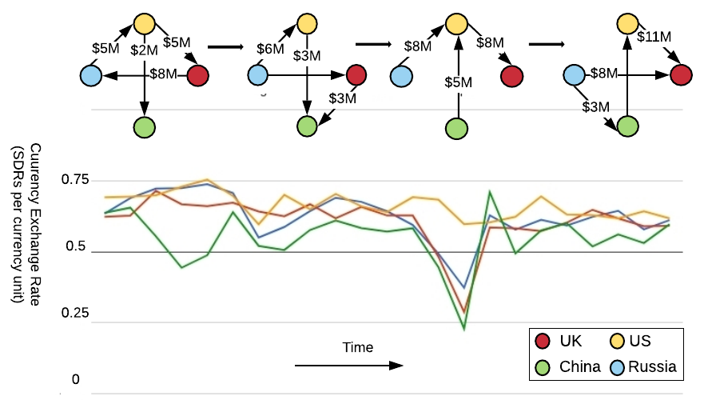
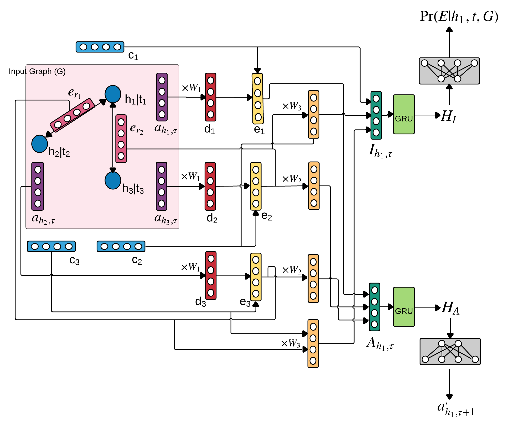

# DArtNet

Paper: [Temporal Attribute Prediction via Joint Modeling of Multi-Relational Structure Evolution](https://arxiv.org/abs/2003.03919)

<p align="center"></p>

Summary: We propose a novel framework to incorporate the temporally-evolving knowledge graph information for time series prediction.

This repository contains the implementation of the DArtNet architectures described in the paper.

<p align="center"></p>

Time series prediction is an important problem in machine learning. Previous methods for time series prediction did not involve additional information. With a lot of dynamic knowledge graphs available, we can use this additional information to predict the time series better. Recently, there has been a focus on the application of deep representation learning on dynamic graphs. These methods predict the structure of the graph by reasoning over the interactions in the graph at previous time steps. In this paper, we propose a new framework to incorporate the information from dynamic knowledge graphs for time series prediction. We show that if the information contained in the graph and the time series data are closely related, then this inter-dependence can be used to predict the time series with improved accuracy. Our framework, DArtNet, learns a static embedding for every node in the graph as well as a dynamic embedding which is dependent on the dynamic attribute value (time-series). Then it captures the information from the neighborhood by taking a relation specific mean and encodes the history information using RNN. We jointly train the model link prediction and attribute prediction. We evaluate our method on five specially curated datasets for this problem and show a consistent improvement in time series prediction results. 

## Quick Links
- [Code Organization](#Organization)
- [Installation](#Installation)
- [Preprocessing](#Preprocessing)
- [Train and Test](#Train-and-Test)

## Organization
Following folders contain the scripts for processing, train and testing.
- data - contains raw data used for the experiments.
- models - contains implementations offrameowrks described in the paper. 
    - contains sigle attribute and multi attribute implementation of our model.

## Installation
Install PyTorch (>= 0.4.0) and DGL following the instuctions on the [PyTorch](https://pytorch.org/) and [DGL](https://www.dgl.ai).
Our code is written in Python3.

## Preprocessing

We need to process the data for fast loading before running the experiments.

```bash
cd data/DATA_NAME
python3 get_history_graph.py
```

## Train and Test

Navigate to the experiment folder

```bash
cd models/Experiment
```

Training the model.
```bash
python3 train.py -d ../../data/DATA_SET --dataset DATA_SET --gpu 1 --model 1 --dropout 0.5 --n-hidden 200 --lr 1e-3 --max-epochs 2 --batch-size 500 --gamma 1 --retrain 0
```
Replace DATA_SET with agg, atg, cac_small, cac_large and mtg for different dataset.

Then validate the model on the validation set.
```bash
python3 validate.py -d ../../data/DATA_SET --dataset DATA_SET --gpu 1 --model 1 --dropout 0 --n-hidden 200 --batch-size 500 --gamma 1
```

From the stored results on the validation set, choose the best epoch to test.
```bash
python3 test.py -d ../../data/DATA_SET --dataset DATA_SET --gpu 1 --model 1 --dropout 0 --n-hidden 200 --batch-size 50 --gamma 1 --epoch EPOCH
```
